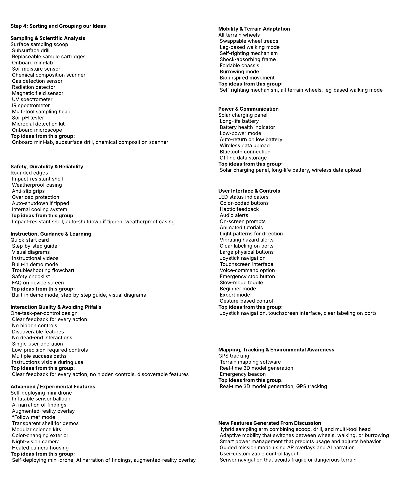
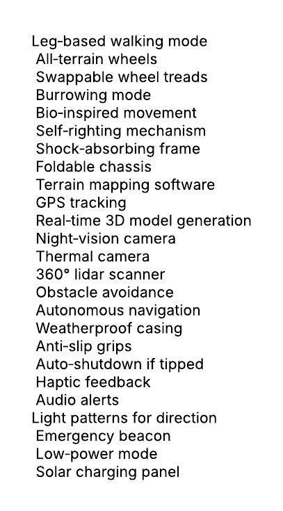
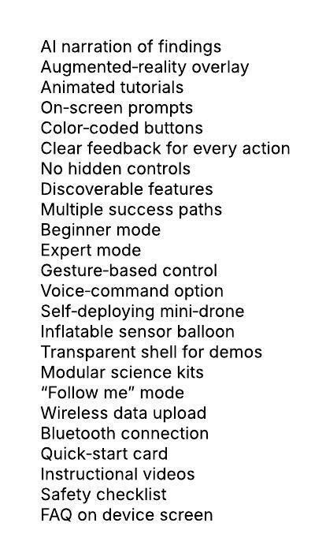

## Exploration Devices 

A surface‑sampling exploration device is designed to directly interact with the ground in order to collect physical material for analysis. Its primary goal is to gather soil, rock, sediment, or other surface‑level samples that can reveal the chemical, geological, or biological characteristics of an environment. By physically retrieving material and relying on remote sensing, the device provides an example of what the surface is made of and how it has changed over time. This hands‑on approach allows researchers to study composition, structure, and environmental conditions with a level of detail that other observation‑only tools can’t match.

The audience for a surface‑sampling device is likely going to include scientists, engineers, and research teams who need accurate, lab‑quality data from locations that are difficult or unsafe to reach. In academic settings, these devices also support students learning about field methods, planetary science, or environmental analysis. Depending on the mission, they may also be used by environmental specialists, geologists, or industrial teams working in remote or hazardous areas. Regardless of the specific user group, the device is built to deliver reliable, well‑documented samples that help people better understand the environment they are studying.

## Generate Ideas 

Our Team each genrate roughly 25 ideas per member. We then placed our ideas on the whiteboard below. 

## Team sorting and Ranking 

We then grouped our ideas into different catergories based on functionality and use. Shown on the whiteboard below 

## Concepts 

After sorting and catergorizing these ideas, our team then came up with 3 concepts each with seperate functions and different purposes. Shown below 

### Concept 1: Precision Surface‑Sampling Rover

Collect high‑quality surface and subsurface samples, analyze them on‑site, and return structured scientific data, Ideas for this concept shown on whitboard below:

### Concept 2: Adaptive Terrain Explorer

Navigate unpredictable, hazardous, or varied terrain using adaptive movement systems and environmental awareness tools. Ideas for this concept shown on whitboard below:

### Concept 3: Assisted Exploration Companion

Support users—students, field teams, or non‑experts—through guided exploration with strong instructional, feedback, and interactive features. Ideas for this concept shown on whitboard below:

## Concept Sketches 

Our team came up with diifferent sketch concepts for our project: 

I put these spots here for a place holder change however nesscary: 

Keith's Design:

Vennessa's Design:

Charlie's Design:

## Selected Concept 
After you guys create sketches we will need to come up with a selected concept for our project before we turn it in. 

And we need to determine who wants to do what functionality for their individual subsystem.  