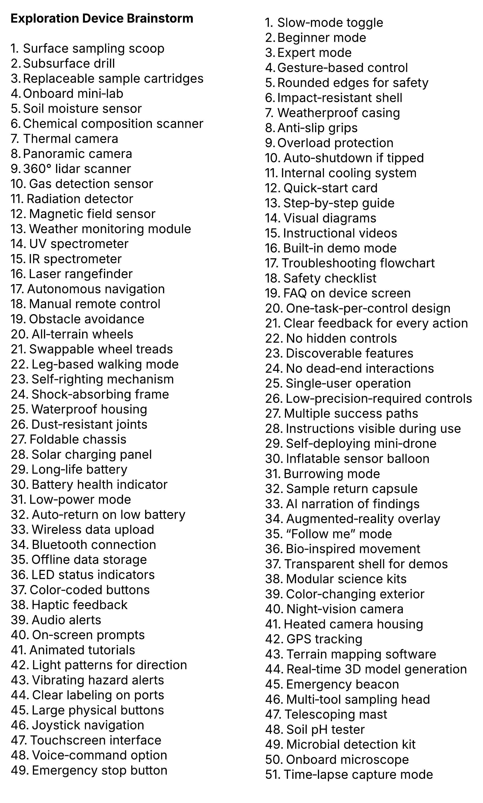
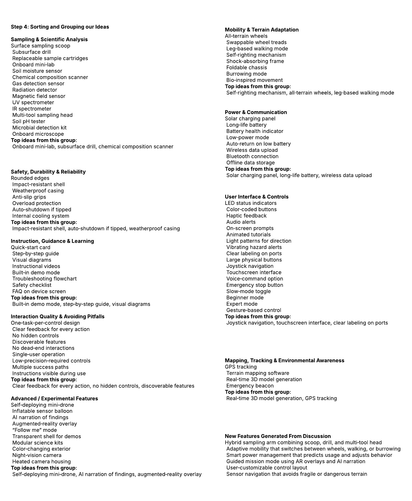
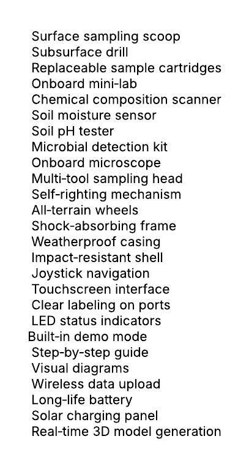
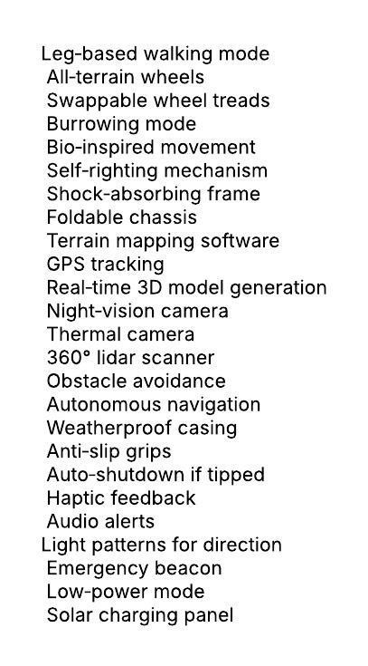
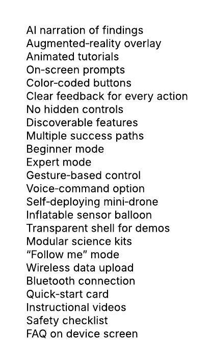
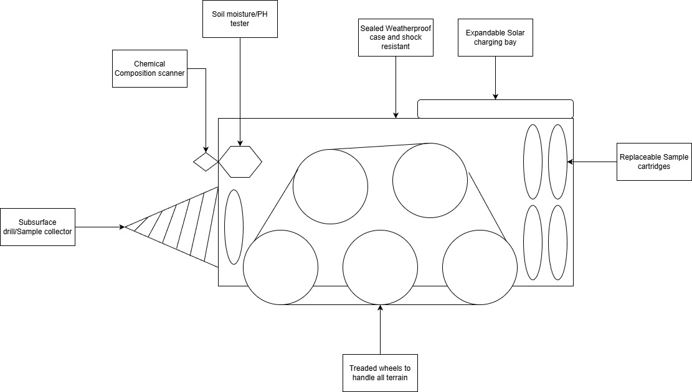
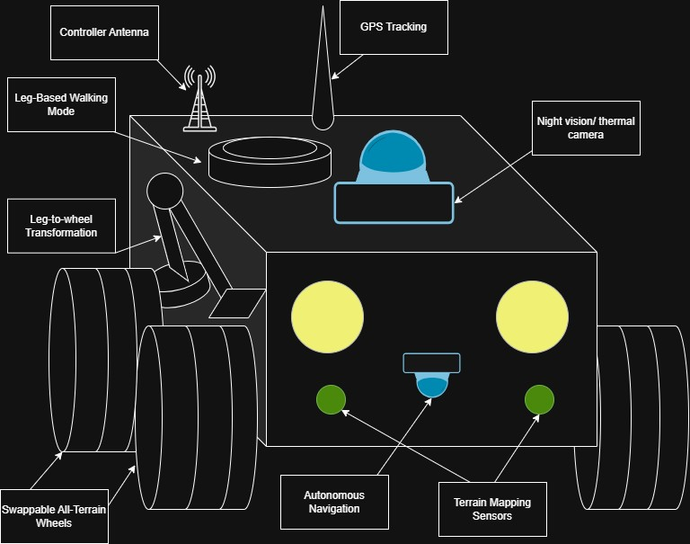
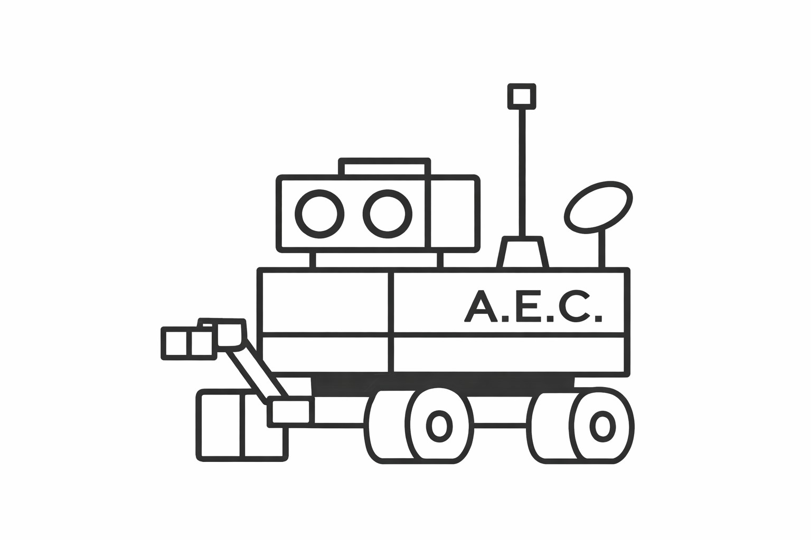

## Exploration Devices

A surface‑sampling exploration device is designed to interact directly with the ground to collect physical material for analysis. Its purpose is to gather soil, sediment, or subsurface samples that reveal chemical, geological, or environmental characteristics of an area. By retrieving physical material and combining it with sensor‑based measurements, the device provides detailed information about the composition and structure of the environment. This approach supports research teams, engineers, and students who need reliable data from locations that may be difficult or unsafe to access.

The intended users for a surface‑sampling rover include scientists, engineering teams, environmental specialists, and academic groups who require accurate, well‑documented samples. These devices also support learning in planetary science, field methods, and embedded systems by demonstrating how sensing, mobility, and data collection can be integrated into a single platform.

## Generate Ideas

Each member of Team 306 generated approximately twenty‑five ideas, which were then collected and placed on the whiteboard shown below.

## Team Sorting and Ranking

The team grouped these ideas into categories based on functionality, purpose, and feasibility. This helped identify common themes and eliminate redundant or impractical concepts.

## Concepts

After sorting and categorizing the ideas, the team developed three main concepts, each representing a different direction for the project.

### Concept 1: Precision Surface‑Sampling Rover

A rover focused on collecting high‑quality surface and subsurface samples, performing on‑site analysis, and returning structured scientific data.  
Ideas for this concept are shown below:

### Concept 2: Adaptive Terrain Explorer

A rover designed to navigate unpredictable or hazardous terrain using adaptive movement systems and environmental awareness tools.

### Concept 3: Assisted Exploration Companion

A rover intended to support students or field teams through guided exploration, instructional feedback, and interactive features.

## Concept Sketches

The team created several sketches to visualize the concepts.

Precision Surface Rover:  

Adaptive Terrain Explorer:  

Assisted Exploration Companion:  

Description:

Mobility:  
Equipped with four robust, square wheels designed to traverse rocky and uneven terrain.

Visual Sensors:  
Two circular “eyes” act as stereo cameras for depth perception and obstacle detection.

Robotic Arm:  
A simple articulated arm allows the rover to manipulate objects or collect samples.

Communication:  
Designed to interact with other subsystems for coordinated operation.

## Updated Ideation Based on Feedback

After receiving feedback throughout the semester, the team refined its understanding of user needs and technical constraints. Several insights shaped the final direction:

• The rover needed a clear, measurable sensing capability, which led to prioritizing magnetic field detection over more complex environmental sensing.  
• The drilling mechanism had to be mechanically simple and electrically reliable, which influenced the final sampling design.  
• Wireless communication needed to remain stable even in noisy environments, guiding antenna placement and message formatting.  
• The human‑machine interface needed to be intuitive, leading to simplified controls and clearer feedback indicators.

These refinements helped narrow the scope of the project while improving the feasibility and reliability of the final design.

## Concept Selection and Decision‑Making Process

The team selected **Concept 1: the Precision Surface‑Sampling Rover** because it aligned most directly with the technical goals of EGR 314 and the subsystem requirements assigned to each member. During the decision‑making process, the team compared the strengths of each concept, evaluated feasibility, and considered how well each idea supported the required embedded systems.

Although Concept 1 was chosen, the final design incorporates elements from the other concepts. From Concept 2, the team adopted ideas related to stability and terrain handling. From Concept 3, the team incorporated clearer user feedback and simplified interaction features. This combination allowed the rover to remain focused on sampling while still benefiting from improved usability and robustness.

## Alignment With Final Design

The final rover design remains consistent with the original intent of Concept 1 but is more streamlined and technically grounded. The electromagnetism‑based sensing system became the primary method for identifying subsurface features. The drilling subsystem was refined to match the mechanical constraints of the rover. The wireless communication and human‑machine interface were simplified to ensure reliable operation during testing.

Overall, the final design reflects a balanced combination of the strongest ideas from the ideation phase, refined through feedback, testing, and practical engineering considerations.
