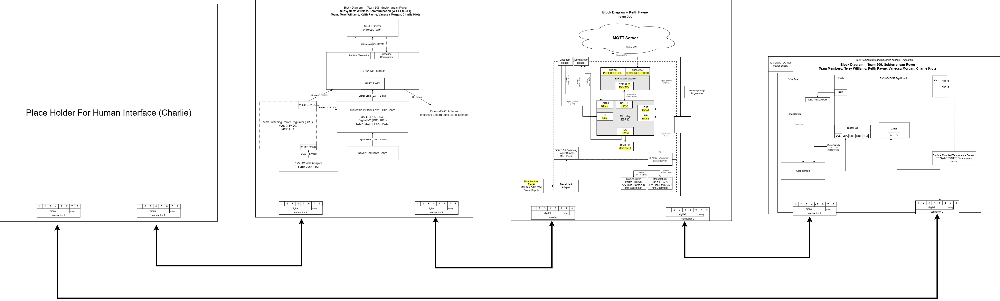
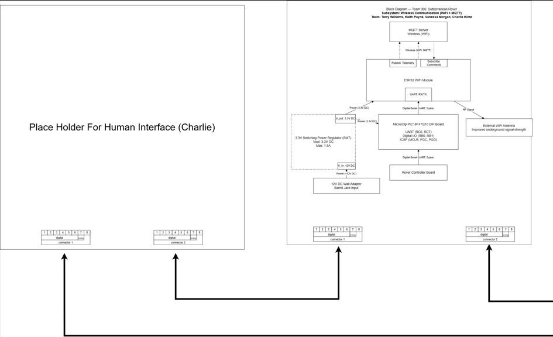

## Block Diagram

#### Introduction

Each subsystem has its own microcontroller and communicates using simple commands. The human interface creates commands, the wireless subsystem forwards them, the motor driver subsystem handles movement and drilling, and the soil sensor subsystem only activates when commanded to take a measurement, then sends its soil composition data back through the wireless subsystem to the operator. Our team Block Diagram is shown below:

**Figure 1:** The over all team block diagram.

Here are some close ups so they can be read easier:

**Figure 2:** The left half of the team block diagram.

**Figure 3:** The right half of the team block diagram.

**Quick Explanation of Flow:** 

- Operator → Human Interface → Wireless
- “Move here/Location” → sent to motor subsystem.
- “Take soil reading here” → sent to sensor subsystem.
- Motor subsystem
- Moves/drills, then reports “done” back through wireless to the operator.
- Sensor subsystem
- Takes a soil reading only when asked, sends the result back through to the operator.

## Protocol/Sequnce Diagram

A sequence diagram for our rover shows a simple request‑and‑response chain: the operator sends a command through the human interface, the wireless subsystem forwards it to the motor subsystem, that subsystem send to the sensor subystem,  performs the action, and the result flows back through wireless to the operator. Our Protocol/Sequnce Diagram is shown below:

**Figure 4:** Protocol/Sequnce Diagram

## Message Structure
