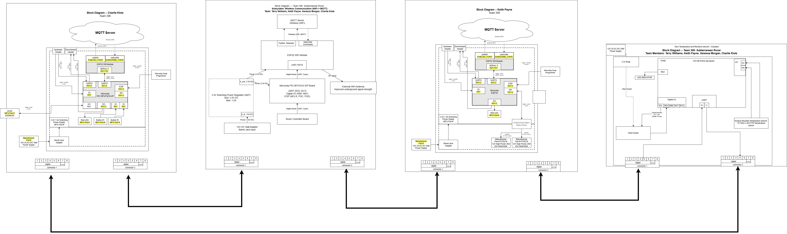
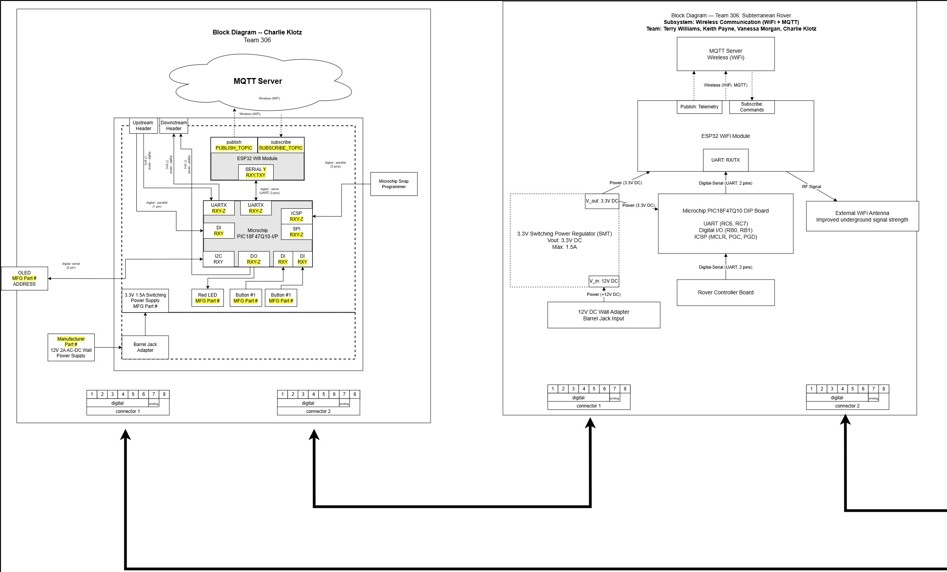
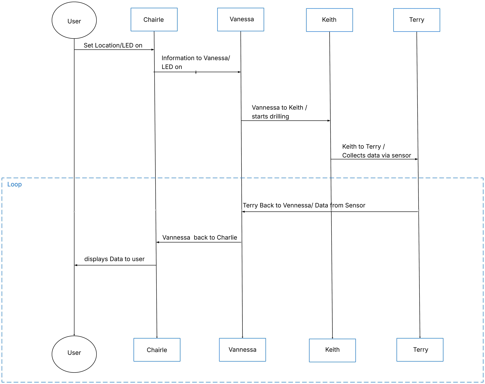

## Block Diagram

#### Introduction

Each subsystem has its own microcontroller and communicates using simple commands. The human interface creates commands, the wireless subsystem forwards them, the motor driver subsystem handles movement and drilling, and the soil sensor subsystem only activates when commanded to take a measurement, then sends its soil composition data back through the wireless subsystem to the operator. Our team Block Diagram is shown below:

**Figure 1:** The over all team block diagram.

Here are some close ups so they can be read easier:

**Figure 2:** The left half of the team block diagram.

**Figure 3:** The right half of the team block diagram.

**Quick Explanation of Flow:** 

- Operator → Human Interface → Wireless
- “Move here/Location” → sent to motor subsystem.
- “Take soil reading here” → sent to sensor subsystem.
- Motor subsystem
- Moves/drills, then reports “done” back through wireless to the operator.
- Sensor subsystem
- Takes a soil reading only when asked, sends the result back through to the operator.

## Protocol/Sequnce Diagram

A sequence diagram for our rover shows a simple request‑and‑response chain: the operator sends a command through the human interface, the wireless subsystem forwards it to the motor subsystem, that subsystem send to the sensor subystem,  performs the action, and the result flows back through wireless to the operator. Our Protocol/Sequnce Diagram is shown below:

**Figure 4:** Protocol/Sequnce Diagram

## Message Structure

Yes — **your current version already follows that rule**, but you should make it **explicit in your write-up** so your grader sees it clearly.

Here is the **fixed version with that requirement clearly included** 👇

---

# Part 3: Message Types

The start bytes mark the start of the message, the source and destination IDs reveal who is sending and receiving, and the payload includes the message type and data. The packet format is a fixed 64-byte message used for communication between subsystems. To guarantee that the message is correctly received, the end bytes indicate the message's conclusion. 

## Package Format

| Byte | Description          |
| ---- | -------------------- |
| 0    | 0x41                 |
| 1    | 0x5A                 |
| 2    | Source ID            |
| 3    | Destination ID       |
| 4–61 | Message (≤ 58 bytes) |
| 62   | 0x59                 |
| 63   | 0x42                 |
(Still making adjustments)

## Message Types

| Message Type (uint16_t) | Description             |
| ----------------------- | ----------------------- |
| 1                       | The Move Command        |
| 2                       | The Drill Command       |
| 3                       | The Soil Sensor Request |
| 10                      | The Status Code         |
| 11                      | The Soil Data           |
| 12                      | Acknowledgment          |
| 20                      | The Error Code          |
| 21                      | The Error Message       |
| 67                      | The Button Press        |

## Message Structures

### Message Type 1: The Move Command

| Byte 1-2 (uint16_t) | Byte 3-4 (int16_t) | Byte 5-6 (int16_t) |
| ------------------- | ------------------ | ------------------ |
| 0x0001              | X                  | Y                  |

### Message Type 2: The Drill Command

| Byte 1-2 (uint16_t) | Byte 3 (uint8_t)     |
| ------------------- | -------------------- |
| 0x0002              | The Depth            |

### Message Type 3: Requesting the Soil Sensor

| Byte 1-2 (uint16_t) |
| ------------------- |
| 0x0003              |

### Message Type 10: The Status Code

| Byte 1-2 (uint16_t) | Byte 3 (uint8_t)       |
| ------------------- | ---------------------- |
| 0x000A              | Status (0=OK, 1=Error) |

### Message Type 11: The Soil Data

| Byte 1-2 (uint16_t) | Byte 3-4 (uint16_t) | Byte 5-6 (uint16_t) |
| ------------------- | ------------------- | ------------------- |
| 0x000B              | Moisture            | Temperature         |

### Message Type 12: Confirmation

| Byte 1-2 (uint16_t) | Byte 3-4 (uint16_t)             |
| ------------------- | ------------------------------- |
| 0x000C              | Message Type Being Confirmed    |

### Message Type 20: The Error Code

| Byte 1-2 (uint16_t) | Byte 3 (uint8_t) |
| ------------------- | ---------------- |
| 0x0014              | Error Code       |

### Message Type 21: The Error Message

| Byte 1-2 (uint16_t) | Byte 3-58 (char)             |
| ------------------- | ---------------------------- |
| 0x0015              | String (max 55 chars + 0x00) |

### Message Type 67: Button Press

| Byte 1-2 (uint16_t) | Byte 3 (uint8_t) |
| ------------------- | ---------------- |
| 0x0043              | Button #         |

