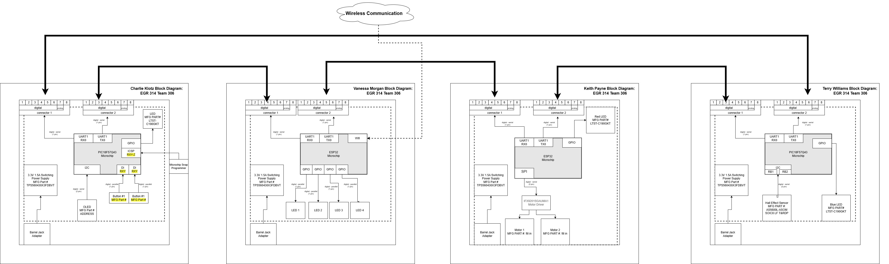
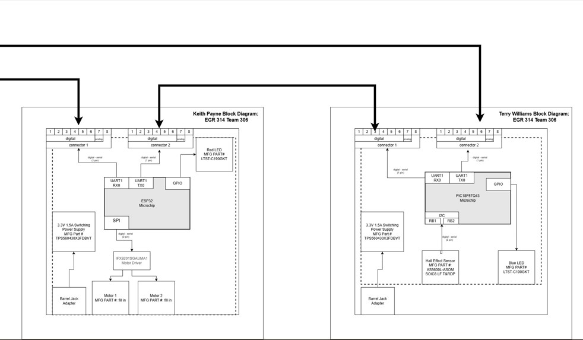
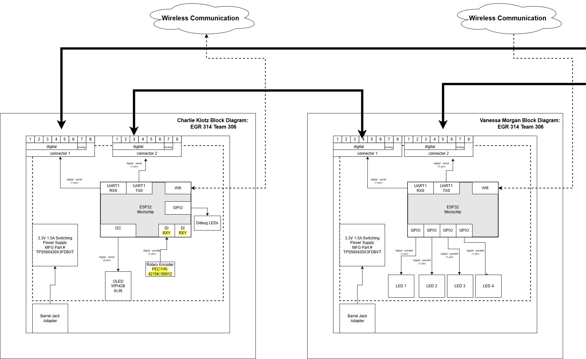
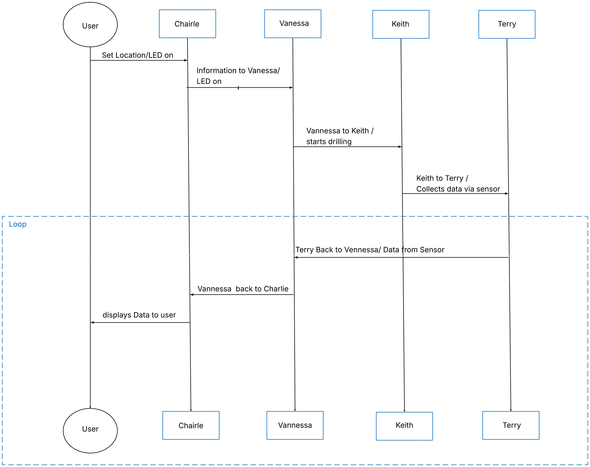

## Block Diagram

### Introduction

Each subsystem in the rover uses its own microcontroller and communicates through a shared messaging protocol. The human interface generates operator commands, the wireless subsystem forwards those commands to the correct destination, the motor subsystem handles movement and drilling, and the sensor subsystem activates only when instructed to take a magnetic reading. Once a subsystem completes its task, it sends a status or data message back through the wireless module to the operator. This structure keeps each subsystem independent while still allowing coordinated rover behavior.

The final Team 306 block diagram is shown below:

  
**Figure 1:** Team 306 block diagram.

Close‑up views for readability:

  
**Figure 2:** Left half of the block diagram.

  
**Figure 3:** Right half of the block diagram.

### Explanation of Block Diagram Structure

The block diagram is structured around the flow of information rather than the physical layout of the rover. This decision was made to clearly show how commands move from the operator to the rover and how data returns to the user. The diagram highlights the independence of each subsystem while showing the wireless module as the central communication hub. This structure meets product requirements by:

• Showing how each subsystem communicates without sharing hardware resources  
• Demonstrating that each subsystem can operate independently  
• Making the command‑and‑response flow easy to understand  
• Reflecting the final hardware layout and team responsibilities  

This layout also incorporates feedback received earlier in the semester, specifically the need to show clearer subsystem boundaries and to emphasize the wireless module’s role as the message router.

---

## Protocol and Sequence Diagram

The rover’s communication sequence follows a simple request‑and‑response model. The operator sends a command through the human interface, the wireless subsystem forwards it to the correct subsystem, and the receiving subsystem performs the action. Once complete, the subsystem sends a status or data message back through the wireless module to the operator.

  
**Figure 4:** Protocol and sequence diagram.

### How the Communication Sequence Satisfies User Needs

The sequence diagram supports user needs by ensuring:

• **Predictable behavior:** Every command results in a clear response, reducing operator uncertainty.  
• **Real‑time feedback:** The operator receives immediate confirmation or data, improving usability.  
• **Subsystem isolation:** Failures in one subsystem do not affect others, increasing reliability.  
• **Traceability:** Each message includes source and destination IDs, allowing debugging and logging.  

This structure ensures the rover behaves consistently and transparently, which is essential for field operation and classroom demonstration.

---

## Message Structure

The rover uses a fixed 64‑byte packet format to ensure consistent communication between subsystems. The start bytes identify the beginning of a message, the source and destination IDs identify who is sending and receiving, the payload contains the message type and data, and the end bytes mark the conclusion of the message.

### Packet Format

| Byte | Description          |
| ---- | -------------------- |
| 0    | 0x41                 |
| 1    | 0x5A                 |
| 2    | Source ID            |
| 3    | Destination ID       |
| 4–61 | Message (≤ 58 bytes) |
| 62   | 0x59                 |
| 63   | 0x42                 |

---

## Message Types

| Message Type (uint16_t) | Description             |
| ----------------------- | ----------------------- |
| 1                       | Move Command            |
| 2                       | Drill Command           |
| 3                       | Soil Sensor Request     |
| 10                      | Status Code             |
| 11                      | Soil Data               |
| 12                      | Confirmation            |
| 20                      | Error Code              |
| 21                      | Error Message           |
| 67                      | Button Press            |

---

## Message Structures

### Message Type 1: Move Command

| Byte 1-2 (uint16_t) | Byte 3-4 (int16_t) | Byte 5-6 (int16_t) |
| ------------------- | ------------------ | ------------------ |
| 0x0001              | X                  | Y                  |

### Message Type 2: Drill Command

| Byte 1-2 (uint16_t) | Byte 3 (uint8_t) |
| ------------------- | ---------------- |
| 0x0002              | Depth            |

### Message Type 3: Soil Sensor Request

| Byte 1-2 (uint16_t) |
| ------------------- |
| 0x0003              |

### Message Type 10: Status Code

| Byte 1-2 (uint16_t) | Byte 3 (uint8_t) |
| ------------------- | ---------------- |
| 0x000A              | Status           |

### Message Type 11: Soil Data

| Byte 1-2 (uint16_t) | Byte 3-4 (uint16_t) | Byte 5-6 (uint16_t) |
| ------------------- | ------------------- | ------------------- |
| 0x000B              | Moisture            | Temperature         |

### Message Type 12: Confirmation

| Byte 1-2 (uint16_t) | Byte 3-4 (uint16_t) |
| ------------------- | ------------------- |
| 0x000C              | Completed Message   |

### Message Type 20: Error Code

| Byte 1-2 (uint16_t) | Byte 3 (uint8_t) |
| ------------------- | ---------------- |
| 0x0014              | Error Code       |

### Message Type 21: Error Message

| Byte 1-2 (uint16_t) | Byte 3-58 (char) |
| ------------------- | ---------------- |
| 0x0015              | Error String     |

### Message Type 67: Button Press

| Byte 1-2 (uint16_t) | Byte 3 (uint8_t) |
| ------------------- | ---------------- |
| 0x0043              | Button Number    |

---

## Design and Decision‑Making Process for Message Structure

The team selected this message structure because it balances simplicity, reliability, and compatibility with the course requirements. The fixed 64‑byte format ensures that every subsystem can parse messages without dynamic memory allocation. The start and end bytes prevent misalignment, especially when using UART. The source and destination IDs allow the wireless subsystem to route messages correctly. The message type field standardizes how commands and data are interpreted across subsystems.

This structure evolved from earlier drafts that were more complex and included variable‑length messages. Feedback from instructors and testing showed that a fixed‑length format was easier to debug and more reliable during noisy communication.

---

## Top Five Software Design Changes Since the Proposal

### 1. Transition from Variable‑Length to Fixed‑Length Messages
Originally, the team planned to use variable‑length packets to save bandwidth. During testing, this caused parsing errors and inconsistent behavior across subsystems. Switching to a fixed 64‑byte format eliminated ambiguity and made UART communication significantly more reliable.

### 2. Introduction of Source and Destination IDs
Early designs assumed point‑to‑point communication. Once the wireless subsystem became the message router, the team added explicit source and destination IDs. This allowed subsystems to ignore irrelevant messages and improved routing clarity.

### 3. Separation of Status Codes and Error Messages
The initial design combined status and error information into a single message type. This made debugging difficult. The team split these into Message Types 10, 20, and 21, allowing clearer reporting and easier logging.

### 4. Standardization of Message Type Field as uint16_t
The proposal used an 8‑bit message type, which limited the number of commands. Expanding to uint16_t allowed more message types and future expansion without breaking compatibility.

### 5. Redesign of the Sequence Diagram to Reflect Real Behavior
The original sequence diagram assumed a linear chain of communication. After integrating subsystems, the team updated the diagram to show the wireless module as the central router. This better reflects the final architecture and clarifies how messages flow through the rover.

---

## Source Files

Please refer to the GitHub repository for:

• Source image files  
• Block diagram source files  
• Editable diagram formats  

These files are included in the project ZIP archive as required.
